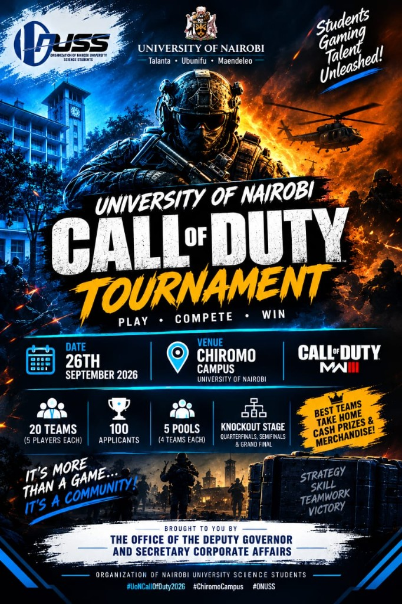
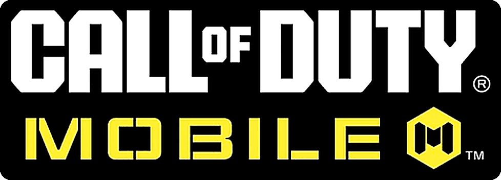
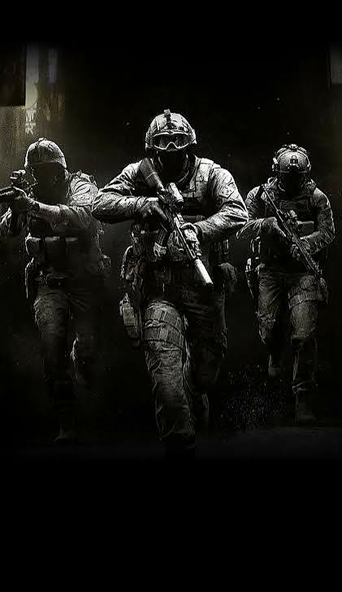
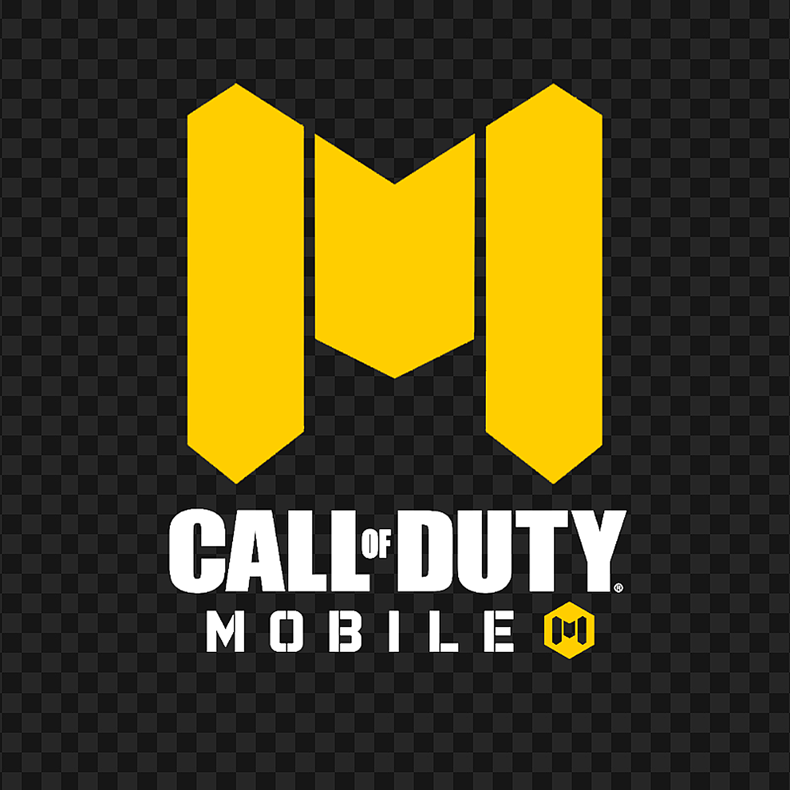
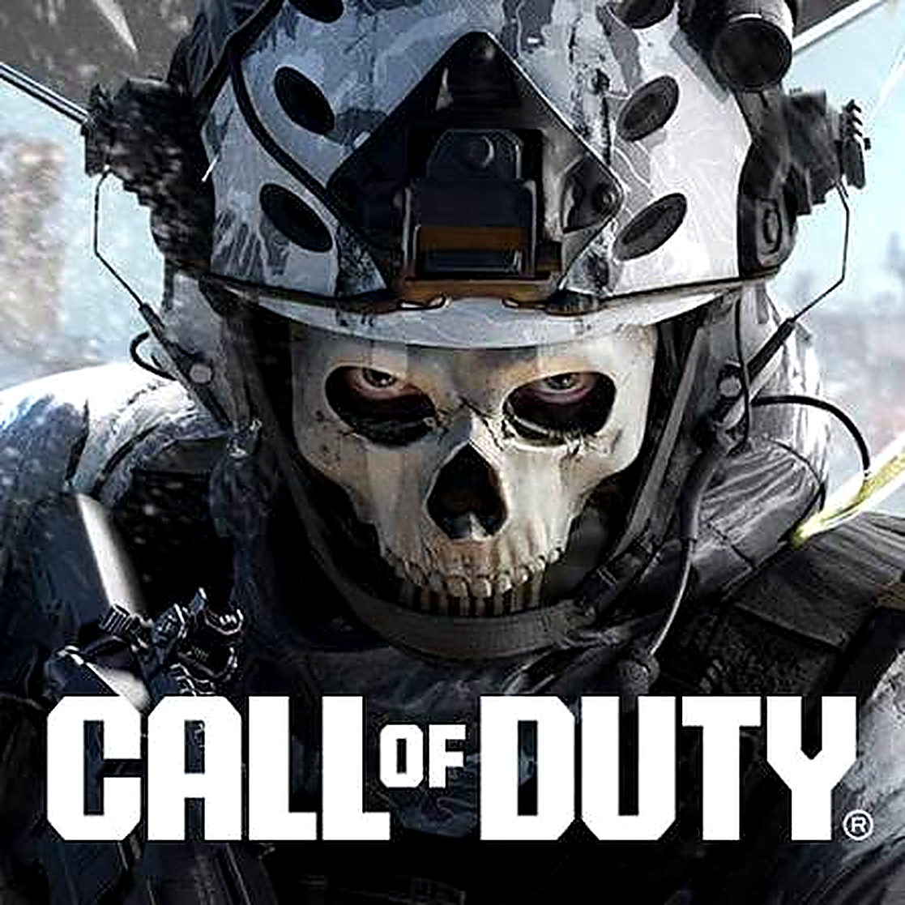

# University of Nairobi Call of Duty Tournament

**Play · Compete · Win**

Official registration & tournament command center for the **University of Nairobi Call of Duty Mobile Tournament** — brought by **ONUSS** (Organization of Nairobi University Science Students).

  

---

## What this is

A dedicated site where students register as **5-player squads**, slots are capped at **100 operators (20 teams)**, and organizers run the event from a live **admin dashboard** — no paper lists, no manual spreadsheets mid-match.

  

---

## Event snapshot

| | |
|---|---|
| **Game** | Call of Duty Mobile |
| **Date** | 26th September 2026 |
| **Venue** | Chiromo Campus, University of Nairobi |
| **Squads** | 20 teams · 5 players each |
| **Cap** | 100 applicants total |
| **Pools** | 5 pools · 4 teams each |
| **Path** | Knockout → Quarterfinals → Semifinals → Grand Final |
| **Prizes** | Cash & merchandise for the best teams |

  

---

## For players — registration

Anyone can open the public page and lock in a full squad in one go.

### What you fill in

For **you (Slot A)** and teammates **B, C, D, E**:

- Full name  
- Phone number  
- School email (preferred)  
- COD Mobile in-game name  

### How slots work

1. You register as **Slot A** (captain).  
2. You add four teammates as **B · C · D · E**.  
3. That counts as **one squad** (5 operators).  
4. When **100 operators / 20 squads** are full, registration closes automatically.

  
  &nbsp;&nbsp;
  

---

## How it looks

### Desktop

Split view — tournament art on the left, Activision-style registration card on the right, with COD × UoN branding.

  

### Mobile

Centered form over tactical COD imagery so phones stay clear and fast to use.

  

### Loading experience

COD Mobile–style loader: status text, yellow progress bar, and percentage — same vibe as launching the game.

  

---

## For organizers — admin command center

Admins sign in at `/admin` and get a tournament desk:

- **Overview** — how many squads / operators are in  
- **Squads** — every roster, slots A–E, contacts & COD names  
- **Pools** — automatic grouping (5 pools × 4 teams)  
- **Live bracket** — generate pool fixtures, enter scores, mark matches live / completed  

Built for match day: update results as games finish — like a FIFA or COD tournament desk, not a spreadsheet scramble.

---

## When registration is full

If all **100 slots** are taken, players see a **Call of Duty–style “Attention”** message. No more sign-ups until organizers reopen capacity.

---

## Branding

| Partner | Mark |
|--------|------|
| University of Nairobi |  |
| ONUSS | Included with UoN on the form header |
| Call of Duty Mobile |  |

  

---

## Hashtags

`#UonCallOfDuty2026` · `#ChiromoCampus` · `#ONUSS`

---

## Tagline

> It’s more than a game… it’s a community.

**Strategy · Skill · Teamwork · Victory**

---

*Brought to you with the Office of the Deputy Governor and Secretary Corporate Affairs · ONUSS · University of Nairobi*
